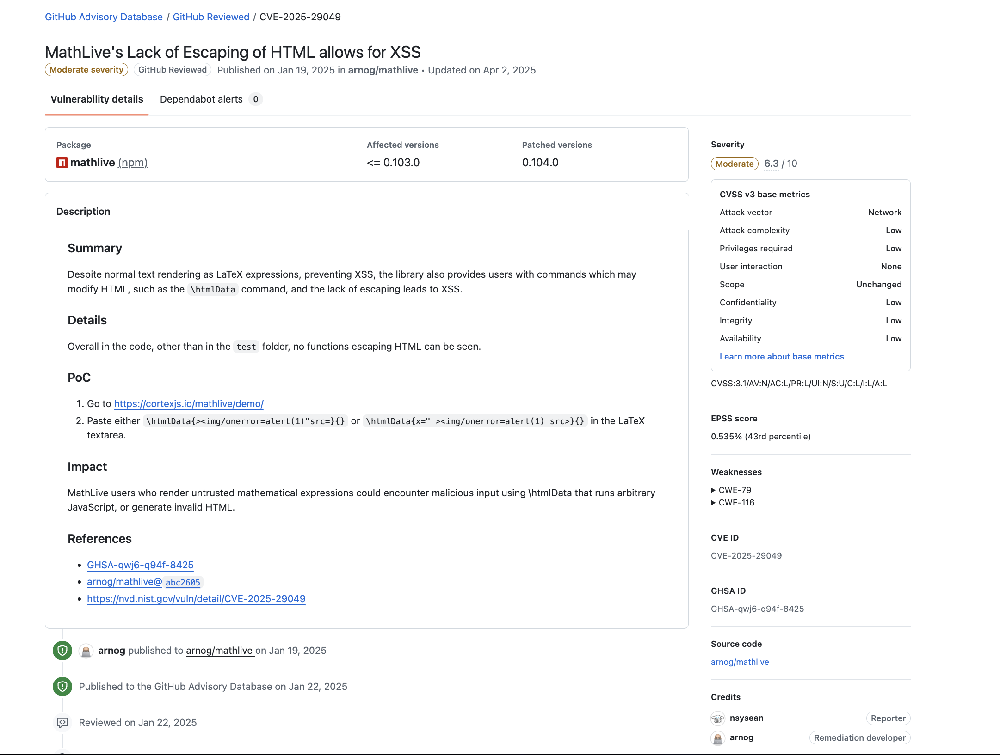

## Preview

This was one of my first CVEs lol, having entered the ctf community not even a year and getting dragged/peer pressured in this by [ensy](https://ensy.zip)

## Some background info

Mathlive is an open-source web component and JavaScript library used to type, edit, and display high-quality mathematical formulas on web pages.

So like, going into here blind was pretty funny, but of course I ~~stalked~~ ensy's website and found out that he had a [CVE](CVE-2025-29049) in MathLive, 

I struck gold, in the github advisory by ensy, he found out that the library also provides users with commands which may modify HTML, such as the `\htmlData command`, and the lack of escaping leads to XSS!!

Naturally, I dug deeper into the patch for this XSS, and surprisingly despite the 0.104.0 patch escaping attribute-bearing constructs (`\htmlData`, `\href`), text-content reflection was missed. So does this mean that there were chances for other XSSes????

After some more research, I found out that `\text{}`, `\mbox{}` commands accept arbitrary characters in their body and emit them raw and unescaped into both the HTML markup and the MathML output and guess what? Thats XSS!!

## POC
`\mbox{}` and `\\text{}`

## Conclusion

This was one of my first ever CVEs, and truly a step forward from a web noobie lol, I have reported the XSS vulnerability responsibly, and it has since been fixed in [this commit](https://github.com/arnog/mathlive/commit/5fe1c46153883f9ec0249a5c8c34e64aaae9cfb8). 

Thanks to [ensy](https://ensy.zip) for giving me inspiration and teaching me web exploitation!! Anyways, I hope you found this writeup interesting. Thanks for reading!

this is definitely not my first real writeup :( and this is 100% not a steal from [ensy](https://ensy.zip)'s payload!!!